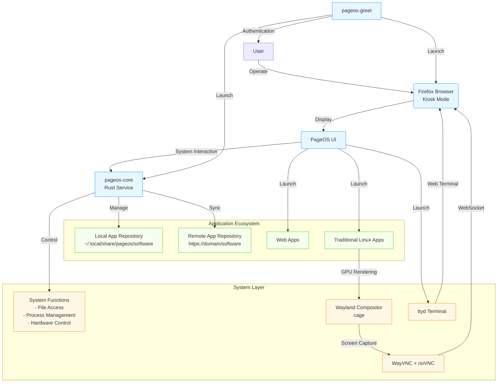

<div align="right" >
  <details>
    <summary >🌐 Language</summary>
    <div>
      <div align="right">
        <p><a href="#">English</a></p>
        <p><a href="README.md">简体中文</a></p>
      </div>
    </div>
  </details>
</div>

# PageOS - A Web-Centric OS Based on Arch Linux

**PageOS** is a revolutionary Linux distribution that transforms the entire operating system experience into a modern web interface. Through innovative architecture design, PageOS allows users to perform all system operations through a browser while maintaining compatibility with traditional Linux applications.



## ✨ Core Concepts

- **Web-Centric Architecture**: The entire user interface is implemented in HTML/CSS/JavaScript, running in Firefox kiosk mode
- **System as a Service**: Complete system API provided by Rust-written backend service
- **Hybrid App Ecosystem**: Supports both web apps and traditional Linux applications
- **Lightweight & Efficient**: Based on Arch Linux and Wayland compositor

## 🧩 Core Components

### 1. pageos-greet

**Login Manager Service**

- Login interface server written in Rust
- Supports custom HTML login pages
- Integrated with greetd display manager

```bash
pageos-greet \
  --port 12801 \
  --page /path/to/login.html \
  --launch-command "cage -s -- firefox --kiosk --no-remote http://127.0.0.1:12801"
```

### 2. pageos-core

**System Core Service**

- Bidirectional server written in Rust
- Provides system management APIs (reboot, file access, etc.)
- Manages local and remote app repositories
- Comes with built-in UI by default, supports customization

```bash
pageos-core -p 12800 --command "cage -s -- firefox --kiosk --no-remote http://127.0.0.1:12800"
```

### 3. pageos-apps

**Official Web App Repository**

- Pre-installed system apps (Settings, File Manager, etc.)
- App metadata specification (metadata.json)
- Permission management system

### 4. pageos-pkgr

**App Repository Management Tool**

- Repository management program written in Rust
- Supports creating, updating and syncing software sources
- Works with pageos-pkgr-ui to provide GUI interface

## 🚀 Technical Highlights

1. **Hybrid App Support**

   - Web Apps: Run directly in browser
   - Traditional Apps: GPU-accelerated rendering via WayVNC + noVNC
   - Terminal: Integrated ttyd provides web terminal

2. **Security Architecture**

   - App sandbox isolation
   - Fine-grained permission control
   - CSP content security policy
   - App signature verification

3. **Unified Development Experience**
   ```json
   // metadata.json example
   {
     "name": "Settings Manager",
     "id": "pageos.settings-manager",
     "version": "1.0.0",
     "permissions": ["system:reboot", "fs:read:/etc"],
     "entry": "index.html"
   }
   ```

## 📥 Download & Experience

PageOS is currently in development. You can participate by:

```bash
# Clone build template
git clone https://github.com/swaybien/pageos

# Build ISO image
cd pageos
./build.sh -v
```

Pre-built images will be released later. Stay tuned for updates.

## 🤝 Contribution Guide

Welcome developers to participate in PageOS ecosystem:

1. Report issues or submit feature requests
2. Contribute web apps to [pageos-apps](https://github.com/swaybien/pageos-apps)
3. Improve core components
4. Write documentation or localization translations

## 📜 License

PageOS and related components are released under **GPLv3** license

---

**Redefining traditional OS experience - Everything implemented in browser**
[Project Home](https://github.com/swaybien/pageos) | [Documentation](https://github.com/swaybien/pageos/docs)
