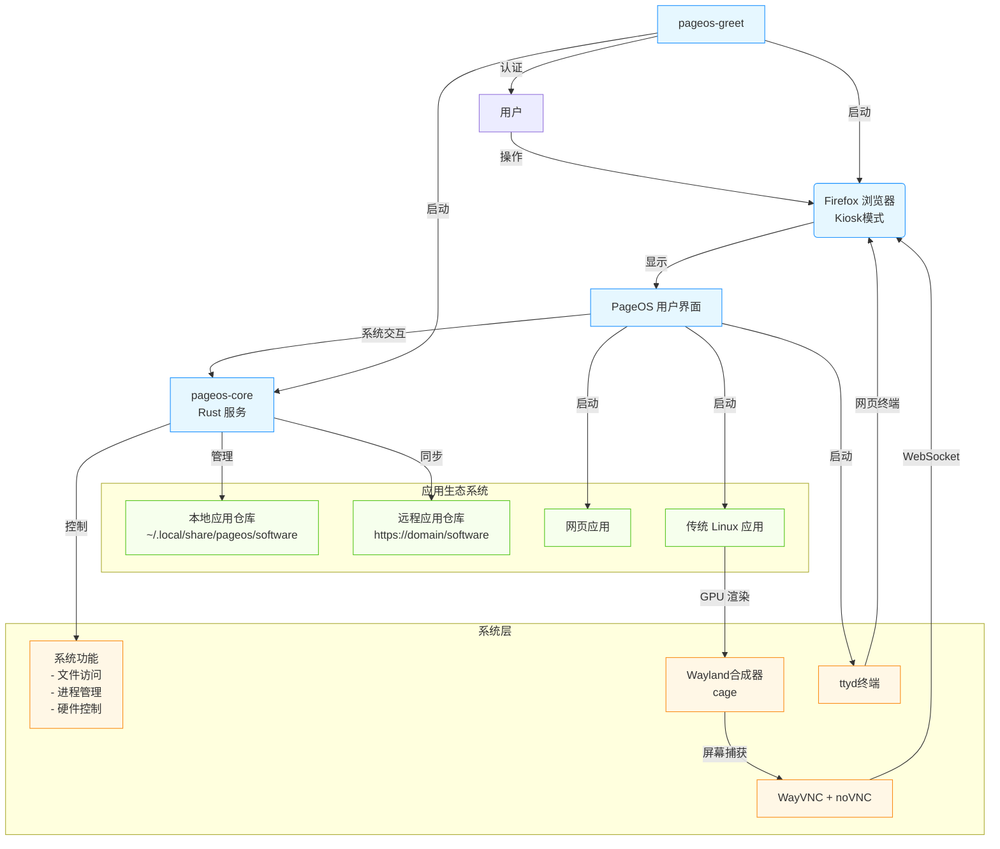

<div align="right" >
  <details>
    <summary >🌐 语言</summary>
    <div>
      <div align="right">
        <p><a href="README.en.md">English</a></p>
        <p><a href="#">简体中文</a></p>
      </div>
    </div>
  </details>
</div>

# PageOS - 基于 Arch Linux 的 Web-Centric 操作系统

**PageOS** 是一款革命性的 Linux 发行版，将整个操作系统体验转化为现代化的 Web 界面。通过创新的架构设计，PageOS 让用户通过浏览器即可完成所有系统操作，同时保持传统 Linux 应用的兼容性。



## ✨ 核心理念

- **Web-Centric 架构**：整个用户界面由 HTML/CSS/JavaScript 实现，运行在 Firefox kiosk 模式中
- **系统即服务**：通过 Rust 编写的后台服务提供完整的系统 API
- **混合应用生态**：同时支持 Web 应用和传统 Linux 应用
- **轻量高效**：基于 Arch Linux 和 Wayland 合成器

## 🧩 核心组件

### 1. pageos-greet

**登录管理器服务**

- Rust 编写的登录界面服务器
- 支持自定义 HTML 登录页面
- 集成 greetd 显示管理器

```bash
pageos-greet \
  --port 12801 \
  --page /path/to/login.html \
  --launch-command "cage -s -- firefox --kiosk --no-remote http://127.0.0.1:12801"
```

### 2. pageos-core

**系统核心服务**

- Rust 编写的双向服务端
- 提供系统管理 API（如重启、文件访问等）
- 管理本地和远程应用仓库
- 默认提供内置用户界面，支持自定义

```bash
pageos-core -p 12800 --command "cage -s -- firefox --kiosk --no-remote http://127.0.0.1:12800"
```

### 3. pageos-apps

**官方网页应用仓库**

- 预装系统应用（设置、文件管理器等）
- 应用元数据规范（metadata.json）
- 权限管理系统

### 4. pageos-pkgr

**应用仓库管理工具**

- Rust 编写的仓库管理程序
- 支持创建、更新和同步软件源
- 与 pageos-pkgr-ui 配合提供图形界面

## 🚀 技术亮点

1. **混合应用支持**

   - Web 应用：直接通过浏览器运行
   - 传统应用：通过 WayVNC + noVNC 实现 GPU 加速渲染
   - 终端：集成 ttyd 提供网页终端

2. **安全架构**

   - 应用沙盒隔离
   - 细粒度权限控制
   - CSP 内容安全策略
   - 应用签名验证

3. **统一开发体验**
   ```json
   // metadata.json 示例
   {
     "name": "设置管理器",
     "id": "pageos.settings-manager",
     "version": "1.0.0",
     "permissions": ["system:reboot", "fs:read:/etc"],
     "entry": "index.html"
   }
   ```

## 📥 获取与体验

PageOS 目前处于开发阶段，您可以通过以下方式参与：

```bash
# 克隆构建模板
git clone https://github.com/swaybien/pageos

# 构建 ISO 镜像
cd pageos
./build.sh -v
```

预构建镜像将在后续发布，请关注项目更新。

## 🤝 贡献指南

欢迎开发者参与 PageOS 生态系统建设：

1. 报告问题或提交功能请求
2. 贡献网页应用到 [pageos-apps](https://github.com/swaybien/pageos-apps)
3. 改进核心组件
4. 编写文档或本地化翻译

## 📜 许可证

PageOS 及相关组件采用 **GPLv3** 许可证发布

---

**颠覆传统的操作系统体验 - 一切皆在浏览器中实现**
[项目主页](https://github.com/swaybien/pageos) | [文档](https://github.com/swaybien/pageos/docs)
